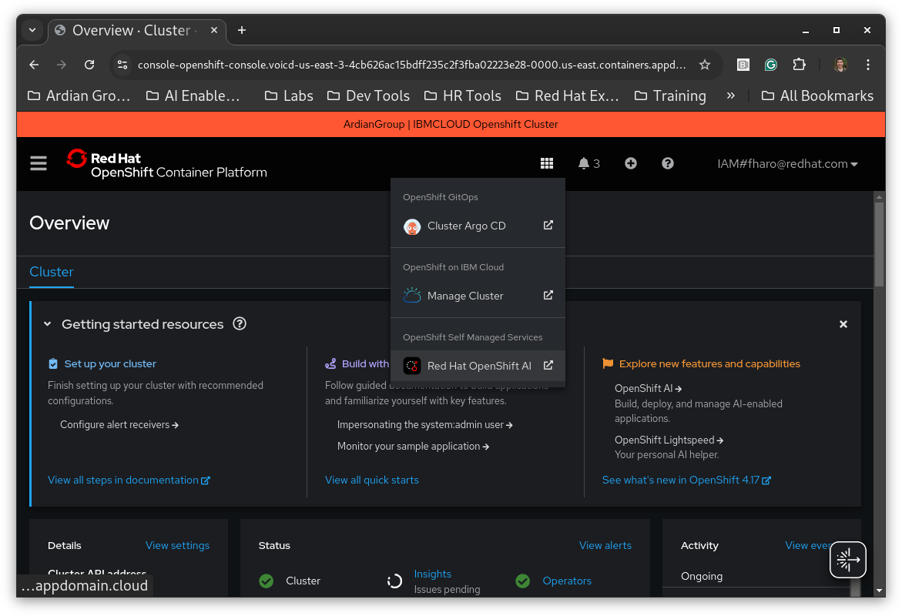

# Installing Red Hat OpenShift AI

This document contains the steps for installing and configuring Red Hat OpenShift AI (RHOAI) on your existing OpenShift cluster using this ai-accelerator repository.

## Table of Contents

- [Assumptions](#assumptions)
- [Prerequisites](#prerequisites)
- [Instructions](#instructions)

## Assumptions

* The steps below were tested on ibmcloud RedHat Openshift managed service. So the steps assume that you will be carrying out this guide on a similiar instance. In principle, the steps should be similiar enough to work for other cloud provider and Openshift setups. For example, ARO (Azure with RedHat Openshift) or ROSA (RedHat Openshift on AWS) or Openshift on prem. However, each cloud provider may have settings that differ so look out for those. For instance, read this [document](../bootstrap/overlays/rhoai-ibmcloud-lab/README.md) to see some of the hiccups we had using ai-accelerator for IBM Cloud Openshift Managed instance.

## Prerequisites

### OpenShift Cluster

- It is recommended to review [RHOAI Supported Configurations documentation](https://access.redhat.com/articles/rhoai-supported-configs).

- The steps require an account with appropriate permissions for installing operator and configuration installation. Typically the `kubeadmin` user that came with Openshift or if that has been disabled a user with cluster-admin role. Please see this [documentation](https://docs.redhat.com/en/documentation/openshift_container_platform/4.19/html/authentication_and_authorization/using-rbac#default-roles_using-rbac) for reviewing out of the box RedHat Openshift cluster roles.

- Functional storage provisioner available with a default StorageClass.


### Client Tooling

The following are required for the bootstrap scripts. If unavailable the scripts will attempt to download required tools and store them at `.\tmp`:

- [oc](https://docs.redhat.com/en/documentation/openshift_container_platform/latest/html-single/cli_tools/index#cli-getting-started) - OpenShift command-line interface (CLI).

- [kustomize](https://kubectl.docs.kubernetes.io/installation/kustomize/) - Kubernetes native configuration and transformation tool.

- [kubeseal](https://github.com/bitnami-labs/sealed-secrets#overview) - Encryption tool used for creating the SealedSecret resource.

- [openshift-install](https://github.com/openshift/installer/releases) (optional) - Tool used for monitoring the [cluster installation progress](https://docs.redhat.com/en/documentation/openshift_container_platform/4.17/html-single/installing_on_any_platform/index#installation-installing-bare-metal_installing-platform-agnostic).

- [yq](https://github.com/mikefarah/yq?tab=readme-ov-file#install) - a lightweight and portable command-line YAML, JSON and XML processor. Used by installation scripts when working with configuration files. WARNING!! The yq python implementation does not work. Ensure to use the implementation from this mentioned GitHub repository.

### Access to an OpenShift Cluster

Before running the steps below make sure you are logged into the cluster as a cluster admin using `oc login...`.

## Instructions

Note: After executing these steps, the cluster may still take 10-15 minutes to finish installing/updating both argocd and rhoai. It is normal for there to be a lot of progress and/or degraded states in the ArgoCD ui during the bootstrapping process and a bit time thereafter.

| Steps | Notes |
|----------|----------|
| 1. Clone this git repository: `git clone https://github.com/ardiangroupinc/ai-accelerator.git`. | This can be cloned to your local workstation, OR to a [Bastion server](https://docs.redhat.com/en/documentation/openshift_container_platform/4.17/html-single/networking/index#accessing-hosts) hosted within the OpenShift cluster subnet. As long as the machine meets the prerequisites you shoule be fine.  |
| 2. Change to the right directory: `cd ai-accelerator` |  |
| 3. Run the bootstrap script: `./bootstrap.sh` | This begins the installation process. The first thing installed is an argo instance so it is expected to see argo resources created and/or configured in the standard output. |
| 4. Select the appropriate bootstrap option and hit enter. | `./bootstrap.sh`<br>`...`<br>`1) rhoai-ibmcloud-lab`<br>`Please enter a number to select a bootstrap folder: 1` |

Note: If you forked this from the original ai-accelerator project for the very first time or had others fork from your repository then you will see the below output. This project is meant to be forked and made your own so go ahead and select 1.

```
...
Your current working branch is main, and your cluster overlay branch is example-branch.
Do you wish to update it to main?
1) Yes
2) No
Please enter a number to select: 1
...
```

The script does some waiting on argo components before completing. Eventually you should see the following output with a link to ArgoCD.
```
...
GitOps has successfully deployed!  Check the status of the sync here:
https://openshift-gitops-server-openshift-gitops.voicd-us-east-3-4cb626ac15bdff235c2f3fba02223e28-0000.us-east.containers.appdomain.cloud
```

You can also access either argocd or rhoai by issuing the following oc commands respectively.
```
$ oc get routes/openshift-gitops-server -n openshift-gitops
```

```
$ oc get routes/rhods-dashboard -n redhat-ods-applications
```


Alternatively, access argocd or rhoai via the grid button on the Openshift cluster webconsole.



The following diagram illustrates all the core components that have been put in place after the `bootstrap.sh` is done:

